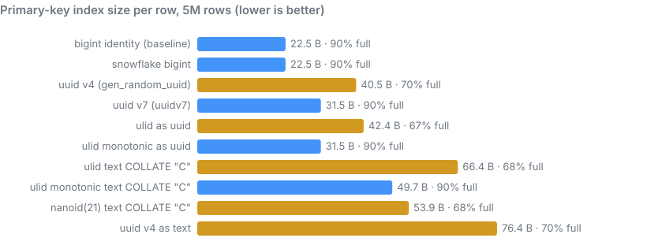
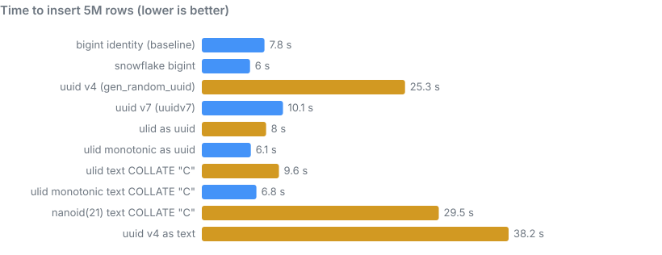
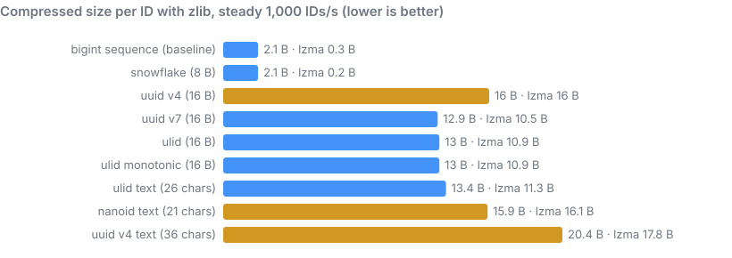

# Data engineering and storage

The choice of ID format decides how many bytes every row, index entry, join key
and foreign key costs, how well columns compress, and whether files and index
pages can be skipped when you query by ID. This page measures those effects
rather than asserting them. Every number comes from scripts in
[`bench/storage/`](https://github.com/rahulbsw/idgenkit/tree/main/bench/storage)
that you can rerun on your own hardware.

## What we measured

1. **PostgreSQL 18 primary keys**
   ([`pg_storage.sh`](https://github.com/rahulbsw/idgenkit/blob/main/bench/storage/pg_storage.sh)).
   For each ID type, a table `(id <type> PRIMARY KEY, v int)` gets 5,000,000
   rows from one `INSERT ... SELECT` after a `CHECKPOINT`. We record insert
   time, heap and index size, B-tree leaf density from `pgstattuple`, and the
   WAL written. UUIDv4 and UUIDv7 use PostgreSQL's own `gen_random_uuid()` and
   `uuidv7()`; the others use the idgenkit extension.
2. **Column compression**
   ([`compression.py`](https://github.com/rahulbsw/idgenkit/blob/main/bench/storage/compression.py)).
   One million IDs per format are written in generation order, as a steady
   stream at 1,000 and at 100,000 IDs per second, all from the same synthetic
   clock. Each column is stored as fixed-width binary or ASCII and compressed
   with zlib and LZMA, as a stand-in for a columnar file with a general-purpose
   codec.

The runs used Docker on an Apple M-series Mac (4 CPUs, 6 GB for the VM) with
the default `shared_buffers = 128MB`. Absolute times will differ on your
hardware; the ratios between formats are what matter.

## Results: PostgreSQL primary keys

| ID type | Insert 5M rows | Table | Index | Index per row | Leaf pages full | WAL |
|---|---|---|---|---|---|---|
| `bigint` identity (baseline) | 7.8 s | 211 MB | 107 MB | 22.5 B | 90% | 676 MB |
| Snowflake `bigint` | 6.0 s | 211 MB | 107 MB | 22.5 B | 90% | 661 MB |
| UUIDv7 `uuid` (`uuidv7()`) | 10.1 s | 249 MB | 150 MB | 31.5 B | 90% | 743 MB |
| ULID monotonic as `uuid` | 6.1 s | 249 MB | 150 MB | 31.5 B | 90% | 743 MB |
| ULID (plain) as `uuid` | 8.0 s | 249 MB | 202 MB | 42.4 B | <span class="warn">67%</span> | 796 MB |
| UUIDv4 `uuid` (`gen_random_uuid()`) | <span class="bad">25.3 s</span> | 249 MB | 193 MB | 40.5 B | <span class="warn">70%</span> | 813 MB |
| ULID monotonic `text COLLATE "C"` | 6.8 s | 287 MB | 237 MB | 49.7 B | 90% | 869 MB |
| ULID (plain) `text COLLATE "C"` | 9.6 s | 287 MB | 317 MB | 66.4 B | <span class="warn">68%</span> | 963 MB |
| Nano ID `text COLLATE "C"` | <span class="bad">29.5 s</span> | 287 MB | 257 MB | 53.9 B | <span class="warn">68%</span> | 922 MB |
| UUIDv4 as `text` | <span class="bad">38.2 s</span> | 365 MB | 364 MB | 76.4 B | <span class="warn">70%</span> | 1,132 MB |

<figure>
  
  <figcaption>Index size per row. Orange bars are keys that arrive out of order, leaving index pages about 70% full.</figcaption>
</figure>

<figure>
  
  <figcaption>Insert time. Random keys (UUIDv4, Nano ID) are slowest because every insert lands on a random index page.</figcaption>
</figure>

### What the numbers show

**Order of arrival is what matters, not the format name.** Each B-tree ended
up in one of two states:

- **In order** (sequence, Snowflake, UUIDv7, monotonic ULID): new keys always go
  to the right-hand edge of the index. Full pages are left 90% full (PostgreSQL's
  default fill factor), and the pages being written stay in memory.
- **Out of order** (UUIDv4, Nano ID, plain ULID): new keys land between existing
  ones. Pages split half-full, leaving about 70% average density, so the index is
  28–34% larger for the same data.

**Plain ULID is ordered between milliseconds but not within one.** A bulk load
generates thousands of IDs per millisecond, and plain ULIDs within a millisecond
are in random order. The inserts still go to the recent end of the index, so
they're fast (8.0 s), but the pages split as if the keys were random (67% full).
The monotonic generator fixes this completely: it matched `uuidv7()` exactly, at
150.4 MB and 90% full. PostgreSQL 18's `uuidv7()` stays ordered because it adds
a sub-millisecond counter. RFC 9562 makes that counter optional, so check your
UUIDv7 library. At a few IDs per millisecond per generator, the difference
disappears.

**Random keys are slow once the index outgrows memory.** The UUIDv4 index (193
MB) is larger than `shared_buffers` (128 MB), so random inserts keep evicting
and re-reading pages. That's why UUIDv4 took 2.5 times as long as UUIDv7.
Below that size the gap is much smaller; above it, and especially on disks
slower than a laptop SSD, it grows.

**Binary beats text by a wide margin.** The same ULID costs 31.5 index bytes
per row as `uuid` and 49.7 as text. UUIDv4 stored as `text` is the worst option
measured: 76.4 bytes per row, 1.9 times the `uuid` type, and 50% slower to
insert.

**8-byte keys are the cheapest.** Snowflake costs exactly what a `bigint`
sequence costs. It was slightly faster than the identity column here, most
likely because it skips PostgreSQL's sequence machinery. Every UUID-sized key adds 9 bytes per
index entry and about 8 bytes per heap row (211 MB versus 249 MB), and the same
again for every foreign key and every secondary index that includes it.

**WAL differences are modest in this test and larger in production.** Random
keys wrote 9% more WAL than UUIDv7 here. After each checkpoint, PostgreSQL logs a
full image of every page the first time it's modified. One bulk statement
touches each page roughly once, which understates the effect. A steady OLTP
workload with random keys modifies far more distinct pages between checkpoints
than one with ordered keys, which shows up as more WAL, more replication traffic
and larger backups.

MySQL's InnoDB wasn't measured here, but the effect is stronger there: the table
itself is stored in primary-key order, so random keys fragment the table rows as
well as the index.

## Results: column compression

Bytes per ID after compression; lower is better.

| Format | Raw | 1,000/s zlib | 1,000/s LZMA | 100,000/s zlib | 100,000/s LZMA |
|---|---|---|---|---|---|
| `bigint` sequence (baseline) | 8 | 2.1 | 0.3 | 2.1 | 0.3 |
| Snowflake | 8 | 2.1 | 0.2 | 2.2 | 0.3 |
| UUIDv7, 16 bytes | 16 | 12.9 | 10.5 | 11.2 | 9.9 |
| ULID, 16 bytes | 16 | 13.0 | 10.9 | 12.1 | 10.4 |
| ULID monotonic, 16 bytes | 16 | 13.0 | 10.9 | 1.9 | 0.4 |
| ULID text, 26 chars | 26 | 13.4 | 11.3 | 12.4 | 10.9 |
| UUIDv4, 16 bytes | 16 | <span class="bad">16.0</span> | <span class="bad">16.0</span> | <span class="bad">16.0</span> | <span class="bad">16.0</span> |
| Nano ID text, 21 chars | 21 | <span class="bad">15.9</span> | <span class="bad">16.1</span> | <span class="bad">15.9</span> | <span class="bad">16.1</span> |
| UUIDv4 text, 36 chars | 36 | 20.4 | 17.8 | 20.4 | 17.8 |

<figure>
  
  <figcaption>Compressed size at 1,000 IDs per second. Orange bars are formats that don't compress at all.</figcaption>
</figure>

**Randomness can't be compressed.** Each format's floor is its random bits.
UUIDv4 (122 bits) and Nano ID (126 bits) stay at about 16 bytes whatever the
codec. Storing UUIDv4 as text only adds overhead, which compression removes
again.

**Time-ordered 128-bit IDs save about a third.** UUIDv7 and ULID compress their
48-bit timestamp almost completely, but their 74 or 80 random bits (9–10 bytes)
remain. That's about 10–11 bytes per ID with LZMA.

**Snowflake compresses like a sequence.** Consecutive IDs differ only in their
low bits, so a Snowflake column costs 2 bytes per ID with zlib and under half a
byte with LZMA. Parquet's `DELTA_BINARY_PACKED` encoding for `INT64` columns
exploits the same property before any codec runs.

**Monotonic ULID at high rates is a special case.** At 100,000 IDs per second,
99% of monotonic ULIDs are the previous ID plus one, so the column compresses
like a sequence (0.4 bytes). The flip side is predictability: within a
millisecond, the next ID can be guessed from the previous one.

## What this means for data pipelines

### Data skipping in Parquet, Iceberg and Delta

Columnar files keep minimum and maximum values per row group, page or file, and
query engines skip files whose range can't match a filter. When IDs are written
in roughly time order, each file covers a narrow ID range, so filters and joins
on recent IDs read only a few files. With UUIDv4 or Nano ID, every file spans
nearly the full range and none can be skipped. This only helps if data is
written, or sorted with Iceberg sort orders or Delta Z-ordering, in ID order.

### Time is inside the ID

ULID, UUIDv7 and Snowflake carry their creation time to the millisecond, so you
can:

- **Scan by time without a timestamp index.** In PostgreSQL:
  `WHERE id >= snowflake_from_timestamp(now() - interval '1 day')`.
- **Recover the creation time** in any language or in SQL with
  `ulid_timestamp()` and `snowflake_timestamp()`, which helps when debugging
  late or duplicated data.
- **Partition by ID range**, so each range is also a time range.

Keep an explicit `created_at` column when the time matters to the business. The
ID holds the generator's clock at millisecond precision, not the event time, and
generators with skewed clocks produce slightly out-of-order IDs.

### Incremental loads and watermarks

`WHERE id > :last_seen` is an attractive incremental-extraction pattern with
time-ordered IDs, but it is only safe with a single generator and serialized
commits. With several writers, a row with a smaller ID can commit after you've
read past it, because of clock skew between generators or simply a slow
transaction. Either re-read a trailing window (for example the last few
minutes), or use change data capture (logical replication, Debezium) for
correctness.

### Idempotent ingestion

Every format here except a database sequence can be generated by the producer,
before the write. Retries then carry the same ID, and duplicates are removed
downstream with a merge or `ON CONFLICT DO NOTHING`. Snowflake needs a unique
machine id per producer; the others need nothing.

### Joins and memory

Hash joins, sort buffers and shuffles move keys around in memory. An 8-byte
Snowflake key is half the size of a 16-byte UUID or ULID, and a third to a
fifth of the size of 26–36-character strings, which also need string
comparisons. On wide fact tables with several foreign keys, the key format can
be a large share of the row.

### Distributed and range-sharded stores

Time-ordered keys are ideal for a single-node B-tree and harmful for databases
that split data by key range (Spanner, CockroachDB, TiDB, HBase and Bigtable row
keys): every new row goes to the same range, and that node becomes a hotspot.
Use random keys (UUIDv4, Nano ID), or prefix the ordered ID with a hash bucket.
Hash-partitioned systems (Kafka topics, Cassandra, DynamoDB) aren't affected.

### JSON and JavaScript

Snowflake IDs exceed 2⁵³, the largest integer JavaScript's `Number` represents
exactly. Serialize them as strings in JSON and APIs. The other formats are
strings already.

## How to store each type

| Platform | UUID (v4, v7) | ULID | Snowflake | Nano ID |
|---|---|---|---|---|
| PostgreSQL | `uuid` | `uuid` via `ulid_to_uuid()`, or `text COLLATE "C"` | `bigint` | `text COLLATE "C"` |
| MySQL | `BINARY(16)` via `UUID_TO_BIN()` | `BINARY(16)` via `ulid_to_bin()` | `BIGINT` | `CHAR(21)` with an `ascii_bin` collation |
| Parquet | `FIXED_LEN_BYTE_ARRAY(16)`, `UUID` logical type | `FIXED_LEN_BYTE_ARRAY(16)` or `STRING` | `INT64` | `STRING` |
| Iceberg | `uuid` | `fixed[16]` or `string` | `long` | `string` |
| Spark, BigQuery | `STRING` or `BINARY`/`BYTES` (no UUID type) | `BINARY`/`BYTES` or `STRING` | `BIGINT` / `INT64` | `STRING` |
| ClickHouse | `UUID` | `FixedString(16)` or `String` | `UInt64` | `String` |

Prefer the binary forms for keys and convert to text only at the edges (APIs,
logs, URLs). If a column must be text, use a byte-wise collation; locale-aware
collations cost more and can change the sort order.

## Limits of these measurements

- One machine, one PostgreSQL version and bulk single-statement inserts. OLTP
  traffic arrives in many small transactions; the ordered-versus-random gap
  persists, but the absolute numbers change.
- The compression test uses general-purpose codecs on raw columns. Real Parquet
  files add dictionary and delta encodings; dictionaries don't help columns
  where every value is unique, and delta encoding helps integer columns further.
- Lookups by a single ID aren't shown. They're similar for every format of the
  same byte width; smaller indexes need fewer page reads when the index doesn't
  fit in memory.

Rerun everything with:

```sh
N=5000000 ./bench/storage/pg_storage.sh      # needs Docker
python3 bench/storage/compression.py 1000000
python3 bench/storage/charts.py              # redraws the charts on this page
```
